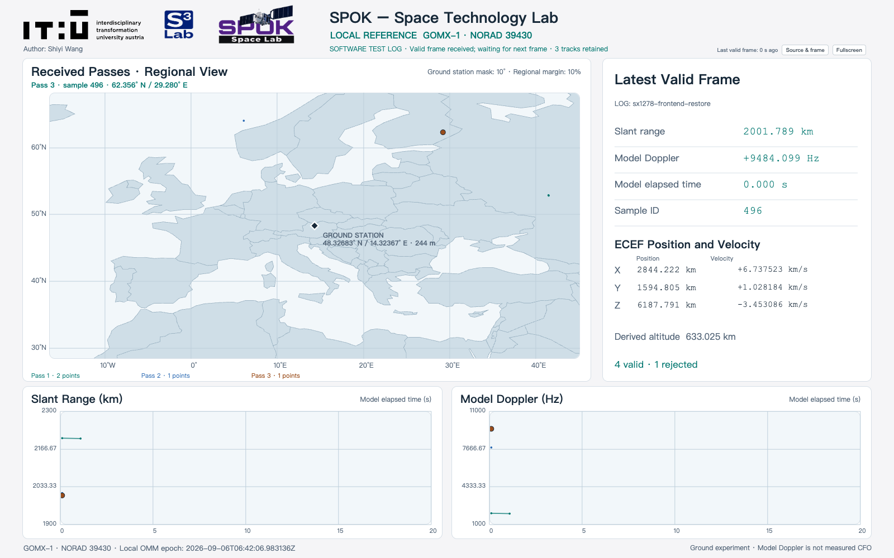

# Receiver dashboard

The public receiver uses the full approved design: the IT:U, S3 Lab and SPOK Space Lab header, author credit, regional map, latest telemetry, slant range and model Doppler plots, and the source and raw frame dialog. The HTML, renderer, stylesheet, approved scene and seven assets were copied without changes from the approved frontend.

This screenshot shows a software test log, as labeled in the page. It is not a record of radio reception. The empty receiver view has no generated observations.

Verification on 23 September 2026 used the production HTTP server and a background Chromium browser on macOS. All 144 Python tests passed. Browser checks covered the empty view, four valid frames across three retained passes, rejection of a fifth frame, the 64-byte frame dialog, retention of points during a failed telemetry request, and automatic recovery. The complete dashboard fitted 1600 × 1000 and 1366 × 768 viewports. Windows hardware reception was not exercised in these checks.

After updating an existing clone, restart the local receive or display process and reload `http://127.0.0.1:8878/monitor` with Ctrl+Shift+R. The renderer, map and logos are served from the local repository.
